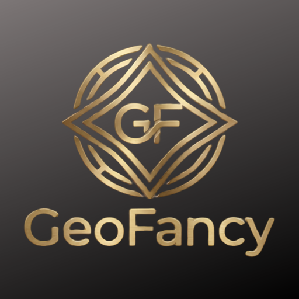

<p align="center">
  
</p>

<h1 align="center">Geofancy</h1>

<p align="center">
  <em>The most advanced geomancy software available, built with users in mind by a devoted practitioner — powered by the Geofancy engine.</em>
</p>


**Live app:** <https://geofancy.up.railway.app>

> **Beta release.** Geofancy is in active development. Charts, interpretations, perfections, and the Way of Points engine are stable and tested, but the app continues to evolve. Bug reports and feedback are welcome.

---

## What Geofancy does

Geofancy is a complete digital tool for traditional Western geomancy — the Renaissance art of casting and interpreting charts of sixteen elemental figures. The app generates a full chart from a question, calculates the Mothers, Daughters, Nieces, Witnesses, Judge, and Reconciler, and walks the practitioner through:

- The four classical **perfections** (Occupation, Translation, Mutation, Conjunction) and their supporting and opposing aspects
- The **Way of Points** for tracing the path of an outcome through the chart
- A complete **Court and Houses** reference panel with original interpretive corpus for every figure in every house and court position
- A printable, responsive chart view with traditional shield notation

It is meant for both the working practitioner and the serious student.

## Features

- **Two workspaces.** A wide desktop layout that gives the chart and details room to breathe, and a mobile-first layout where the chart fills the screen and tabs collapse into focused detail panels.
- **Original corpus.** Every interpretive line — figure data, house data, court placements, and contextual blurbs for each figure in each slot — was written from primary sources and the author's practice. No third-party reference material is reproduced.
- **Live perfections engine.** Select your Querent and Quesited and watch every form of perfection, modifier, and aspect populate with practitioner-facing tips.
- **Way of Points analyzer.** Trace the chain of figures, see path types and break conditions, and read structured commentary on what each pattern means.
- **House & court inspector.** Click any house or court position to load a focused detail panel for that figure in that slot, with elemental analysis, traditional imagery, person-and-body correspondences, house affinity, and fully cited sources.
- **Light and dark modes.** Glanceable, accessible.
- **Auto-routing.** The site detects mobile devices and serves the appropriate layout automatically.

## Try it

Open <https://geofancy.up.railway.app> on any device. Cast a chart and the workspace will load.

## Geomancy in one paragraph

Geomancy is a divinatory system that emerged in the medieval Islamic world and reached Europe in the twelfth century, where it flourished alongside astrology through the Renaissance. The practitioner generates sixteen binary marks — traditionally by striking the earth, today by any reliable randomization — which are organized into four "Mothers." From the Mothers, four Daughters, four Nieces, two Witnesses, a Judge, and a Reconciler are derived by simple geomantic addition. The resulting chart is then read against the houses of horary astrology to answer the question. Geofancy automates the mechanical steps so the practitioner can give full attention to interpretation.

## Tech stack

- **Frontend:** Blazor Server with InteractiveServer rendering, Blazor WebAssembly client where appropriate
- **Backend:** ASP.NET Core 8 minimal APIs, in-process service mode for the deployed app
- **Domain libraries:** `Geomancy.Core`, `Geomancy.Api.Contracts`, `Geomancy.Api.Handlers` (all .NET Standard 2.0 for cross-target compatibility)
- **Legacy desktop:** WinForms (.NET Framework 4.8) shell, retained for offline practitioner use
- **Hosting:** Railway, Linux container, multi-stage Dockerfile

See [DEPLOY.md](DEPLOY.md) for deployment specifics.

## Repository layout

```
Geomancy.Core/                 Domain logic — figures, houses, chart math, perfections, corpus
Geomancy.Api.Contracts/        DTOs and JSON loaders shared across runtimes
Geomancy.Api.Handlers/         Stateless API handlers used by both web and self-host
GeomancyAPI/                   Legacy .NET Framework 4.8 self-host API (optional)
GeomancyApp/                   Legacy WinForms desktop app
GeomancyWebUI/                 The web app
  GeomancyWebUI/                 Server project, hosting + controllers + pages
  GeomancyWebUI.Client/          WASM client project, models + services
HouseAndCourtDirectory/        House and court reference JSON
WayOfPointsDirectory/          Way of Points configuration JSON
```

## Local development

The web app is the active surface. To run it locally:

```bash
cd GeomancyWebUI/GeomancyWebUI
dotnet run
```

Then open the URL printed in the console. The default configuration uses the in-process service implementation, so no separate API server is required.

## Reporting issues

Please open a [GitHub issue](https://github.com/ThomasShetler/GeomancyApp/issues) for bugs or feature requests. Include the question or chart that produced the unexpected output if you can — it helps reproduce the problem quickly.

## Acknowledgments

Geofancy stands on the shoulders of the geomantic tradition. The corpus draws on, and credits, the public-domain works of:

- **Cornelius Agrippa**, *Three Books of Occult Philosophy* (1531; English 1651)
- **Pseudo-Agrippa**, *Of Geomancy* (Fourth Book of Occult Philosophy, 1655)
- **Christopher Cattan**, *The Geomancie of Maister Christopher Cattan* (1558; English 1591)
- **Robert Fludd**, *De Geomantia* in *Utriusque Cosmi Historia* (1617)
- **John Heydon**, *Theomagia, or the Temple of Wisdome* (1664)
- **Franz Hartmann**, *The Principles of Astrological Geomancy* (1889)

Thanks also to the modern practitioners whose teaching shaped the broader revival of the art. None of their work is reproduced here, but the conversation they kept alive made this project possible.

## License

Geofancy is **proprietary, source-available** software.

- **Source code** is licensed under the [PolyForm Noncommercial License 1.0.0](LICENSE). You may read, study, and modify it for personal and noncommercial purposes; any commercial use requires a separate license from the author.
- **Interpretive corpus** (the prose content of `Geomancy.Core/FigureCorpus.*.cs`, `HouseAndCourtDirectory/*.json`, and `WayOfPointsDirectory/*.json`) is licensed separately under [Creative Commons Attribution-NonCommercial 4.0 International](LICENSE-CORPUS.md).

See [NOTICE.md](NOTICE.md) for the plain-English summary.

For a commercial license — including SaaS reselling, white-label deployments, or inclusion of the engine or corpus in a paid product — please contact:

**Thomas Shetler** · thomas.ja.shetler@gmail.com · Portland, OR, USA

© 2026 Thomas Shetler. All rights reserved beyond the licenses above.
